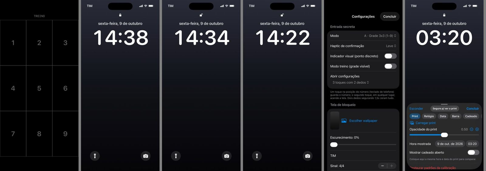

# Voltar no Tempo — app de mágica para iPhone

App iOS (SwiftUI) para uma mágica de close-up: o celular parece apagado, alguém escolhe um número de 1 a 9, a "tela de bloqueio" acende e o relógio **volta no tempo** minuto a minuto. No fim, a hora bate com o celular de todo mundo.

Na tela inicial do iPhone o app aparece como **"Notas Rápidas"**, com ícone de bloco de notas.

- Como apresentar a mágica: [`docs/COMO_APRESENTAR.md`](docs/COMO_APRESENTAR.md)
- Decisões técnicas tomadas durante o desenvolvimento: [`docs/DECISOES.md`](docs/DECISOES.md)



*Da esquerda para a direita: tela preta com a grade de treino, tela de bloqueio (real + 8), rewind no meio, rewind terminado, configurações e calibração.*

---

## Sumário

1. [Você não precisa de Mac](#1-você-não-precisa-de-mac)
2. [Repositório no GitHub](#2-repositório-no-github)
3. [Ver a CI rodando e baixar o .ipa](#3-ver-a-ci-rodando-e-baixar-o-ipa)
4. [Ver os prints gerados pela CI](#4-ver-os-prints-gerados-pela-ci)
5. [Instalar no iPhone com o Sideloadly (Windows)](#5-instalar-no-iphone-com-o-sideloadly-windows)
6. [Limitações do Apple ID grátis](#6-limitações-do-apple-id-grátis)
7. [Primeira configuração](#7-primeira-configuração)
8. [Resumo dos gestos](#8-resumo-dos-gestos)
9. [Quando a CI falhar](#9-quando-a-ci-falhar)
10. [Estrutura do projeto](#10-estrutura-do-projeto)

---

## 1. Você não precisa de Mac

O app é compilado **no GitHub Actions**, num computador macOS da nuvem. A cada `push`, a CI:

| Job | O que faz | Tempo aproximado |
|---|---|---|
| **Build IPA (sem assinatura)** | gera o `TimeRewind.ipa` que você instala no iPhone | ~2 min |
| **Testes unitários (simulador)** | roda os testes de tempo, entrada secreta e rewind | ~4 min |
| **Screenshots (simulador)** | abre cada tela do app num iPhone simulado e tira prints | ~15 min |

A CI roda em push de **qualquer branch** (não só na `main`) e também pode ser disparada à mão em **Actions → Build → Run workflow**.

## 2. Repositório no GitHub

Se você ainda não tem o código no GitHub:

1. Crie uma conta em <https://github.com> (se não tiver).
2. Clique em **New repository**, dê um nome (ex.: `timetravel`) e escolha:
   - **Público**: os minutos de CI são **ilimitados**. O código fica visível para qualquer um (o nome do app na tela inicial continua discreto).
   - **Privado**: o plano grátis tem uma **cota mensal** de minutos, e minutos de **macOS contam cerca de 10×**. Como cada push gasta ~20 min de macOS (os três jobs somados), a cota acaba depressa. Se for usar privado, considere rodar a CI só quando precisar (Actions → Run workflow).
3. Suba os arquivos. O jeito mais fácil no Windows é o **GitHub Desktop** (<https://desktop.github.com>): *File → Add local repository*, depois *Commit* e *Push*. Também dá para arrastar os arquivos na página do repositório (*Add file → Upload files*).

> Este repositório (`arthurgranito/timetravel`) já está no GitHub e é **público**.

## 3. Ver a CI rodando e baixar o .ipa

1. No repositório, abra a aba **Actions**.
2. Clique no run mais recente (o título é a mensagem do commit). Bolinha amarela = rodando, ✅ = passou, ❌ = falhou.
3. Quando o job **Build IPA** ficar verde, role a página do run até **Artifacts**.
4. Baixe **`TimeRewind-<número>`**. Vem um `.zip`: clique com o botão direito → **Extrair tudo**. Dentro está o **`TimeRewind.ipa`**.

## 4. Ver os prints gerados pela CI

No mesmo run, em **Artifacts**, baixe **`screenshots-<número>`** e extraia. Você vai ver:

| Arquivo | Tela |
|---|---|
| `iphone-pro-01-dark-grid.png` | tela preta com a grade de treino |
| `iphone-pro-02-lock.png` | tela de bloqueio mostrando 14:30 + 8 = 14:38 |
| `iphone-pro-03-rewinding-mid.png` | rewind parado no meio (14:34) |
| `iphone-pro-04-live.png` | depois do rewind, sincronizado (14:22) |
| `iphone-pro-05-settings.png` | configurações |
| `iphone-pro-06-calibration.png` | calibração |
| `iphone-se-*.png` | as mesmas telas num iPhone SE (tela pequena, com botão Home) |

O resumo do run (página do run, logo abaixo do gráfico) lista os prints gerados.

## 5. Instalar no iPhone com o Sideloadly (Windows)

### 5.1 Uma vez só: preparar o PC

1. **Instale o iTunes baixado direto do site da Apple**, não o da Microsoft Store: <https://www.apple.com/br/itunes/> → *Download para Windows* (procure o instalador 64 bits). A versão da Microsoft Store não tem os drivers que o Sideloadly precisa.
2. Instale o **Sideloadly**: <https://sideloadly.io>.
3. Conecte o iPhone no PC **com cabo**. No iPhone, toque em **Confiar** e digite o código do iPhone.

### 5.2 Instalar o app

1. Abra o Sideloadly. Seu iPhone deve aparecer no campo do aparelho.
2. Arraste o **`TimeRewind.ipa`** para a janela do Sideloadly.
3. No campo **Apple ID**, coloque o seu Apple ID (pode ser uma conta grátis; se preferir, crie um Apple ID só para isso).
4. Clique em **Start**. Digite a senha do Apple ID quando pedir (e o código de 2 fatores, se aparecer).
5. Espere aparecer **Done**.

### 5.3 Uma vez só: liberar no iPhone

1. **Ajustes → Privacidade e Segurança → Modo Desenvolvedor** → ativar. O iPhone reinicia; depois confirme **Ativar**.
   (Se a opção não aparecer, ela surge depois da primeira instalação pelo Sideloadly.)
2. **Ajustes → Geral → VPN e Gerenciamento de Dispositivos** → toque no seu Apple ID → **Confiar**.
3. Abra **"Notas Rápidas"** na tela inicial. Deve abrir uma tela **totalmente preta**: é isso mesmo.

## 6. Limitações do Apple ID grátis

- O app **expira em 7 dias**. Depois disso ele não abre mais. **Reinstale antes de cada apresentação** (repita o passo 5.2; as configurações e a calibração **continuam salvas**, a não ser que você apague o app).
- No máximo **3 apps** instalados por sideload ao mesmo tempo nesse Apple ID.
- O Sideloadly pode trocar o identificador do app (bundle ID). Tudo bem.

## 7. Primeira configuração

1. Abra o app (tela preta).
2. **Abra as configurações**: faça **3 toques com dois dedos** em menos de 1,5 segundo, em qualquer lugar da tela preta.
3. **Tela de bloqueio → Escolher wallpaper**: escolha a **mesma imagem** do papel de parede da sua tela de bloqueio real.
4. Ajuste **operadora**, **sinal**, **Wi-Fi**, **porcentagem da bateria**, **24h** e **formato da data** para ficarem iguais à sua tela de bloqueio real.
5. **Calibração** (o passo mais importante):
   1. Bloqueie o iPhone, acenda a tela (sem desbloquear) e tire um **print** (botão lateral + volume para cima).
   2. Volte ao app → configurações → **Abrir calibração**.
   3. Aba **Print → Carregar print** e escolha esse print.
   4. Em **Hora mostrada**, coloque a **mesma data e hora** que aparecem no print.
   5. Com a opacidade em ~50%, ajuste **Relógio** (tamanho, peso, fonte, espaçamento, posição, cor), **Data**, **Barra** (status bar), **Cadeado** e **Botões** até tudo coincidir.
   6. Use **"Segure p/ ver o print"** para alternar rápido entre o real e o falso.
   7. **Concluir**. Tudo é salvo automaticamente.
6. **Rewind → Ritmo**: escolha como o relógio volta. **Ritmo fixo** (padrão, 1 minuto por segundo, ajustável de 0,5s a 5s), **Passo a passo** (sempre 1 minuto por segundo, para contar junto com a plateia) ou **Duração total** (o rewind inteiro em X segundos, com aceleração). Em todos, o relógio termina exatamente na hora real.
7. **Ensaiar**: no fim das configurações, **Ensaiar agora** sorteia um número e mostra a grade para você treinar a entrada inteira.
8. **Concluir** (canto superior direito) volta para a tela preta.

## 8. Resumo dos gestos

| Onde | Gesto | O que acontece |
|---|---|---|
| Tela preta | 3 toques com 2 dedos (< 1,5s) | abre as configurações (alternativa: segurar 3s no canto superior esquerdo) |
| Tela preta, modo A (padrão) | 1 toque na posição do número (teclado de telefone: 1 2 3 / 4 5 6 / 7 8 9) | guarda o número |
| Tela preta, modo A | 2º toque em qualquer lugar | acende a tela de bloqueio |
| Tela preta, modo B | toques rápidos (cada um soma 1) + toque longo de 0,6s | acende com N = número de toques |
| Tela preta, modo C | toque da dezena (0–5; o 0 fica no centro, abaixo da grade) + toque da unidade + toque em qualquer lugar | acende com N de 1 a 59 |
| Tela preta | 2 dedos segurando 1,5s | zera tudo |
| Tela de bloqueio | swipe para cima começando na metade de baixo | começa a voltar no tempo (pode trocar por toque duplo no relógio ou automático) |
| Tela de bloqueio | segurar o botão da lanterna | liga/desliga a lanterna de verdade |
| Depois do rewind | segurar 1,5s em qualquer lugar | volta para a tela preta (nova apresentação) |
| Qualquer tela | sair do app | ao voltar, está na tela preta |

A grade fica fora dos **40 pt** de cima e de baixo da tela: toques ali são ignorados.

## 9. Quando a CI falhar

1. Abra o run com ❌ em **Actions**.
2. Na página do run, o **resumo** mostra as linhas de erro (`error:`) logo abaixo dos jobs.
3. Copie esse resumo **ou** baixe o artifact **`build-log-<número>`** (ou `test-log-<número>` se falharam os testes).
4. Cole no Claude Code e peça para corrigir.

## 10. Estrutura do projeto

```
project.yml              projeto (XcodeGen); o .xcodeproj é gerado na CI
App/                     entrada do app e RootView
Core/                    lógica pura e testável (tempo, entrada secreta, rewind, estados)
Settings/                configurações (UserDefaults) e imagens (Documents)
Services/                haptics, bateria, brilho, lanterna
Views/                   tela preta, tela de bloqueio, configurações, calibração, estados de demonstração
Resources/               ícone e cores
Tests/                   testes unitários
scripts/                 scripts da CI (simulador, screenshots), ícone, verificação no Linux
.github/workflows/       CI (build do .ipa, testes, screenshots)
docs/                    como apresentar, decisões, imagens
```
